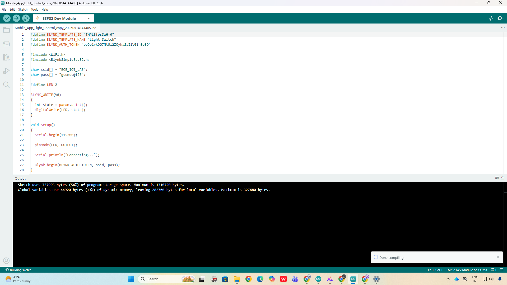
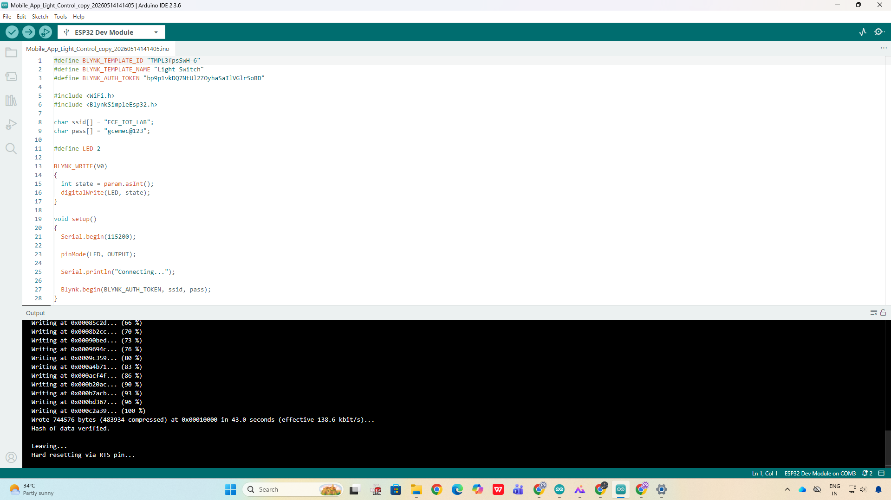
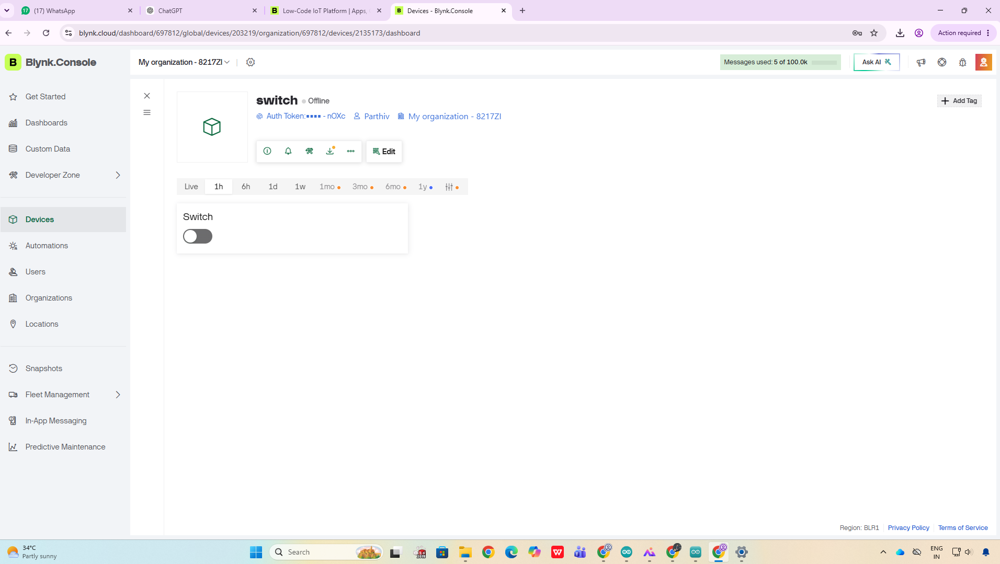

# ESP32 Mobile App Light Control

##  Project Description
This project controls a light using ESP32 through a mobile application.

---

##  Components Used
- ESP32
- Relay Module
- LED
- Resistor 
- Jumper Wires
- Breadboard

---

## Circuit Connections

| ESP32 Pin | Component Pin |
|-----------|---------------|
| GPIO 23   | Relay IN |
| 5V        | Relay VCC |
| GND       | Relay GND |
| Relay NO  | LED Positive |
| GND       | LED Negative |

---

##  Features
- Wireless light control
- Mobile app interface
- ON/OFF control using ESP32

---

##  Project Images

---

### Code Compilation

---

### Uploading to ESP32

---

### Mobile App OFF State

---

### Mobile App ON State

---

### Output OFF

---

### Output ON

##  Developed By
Parthiv A M
